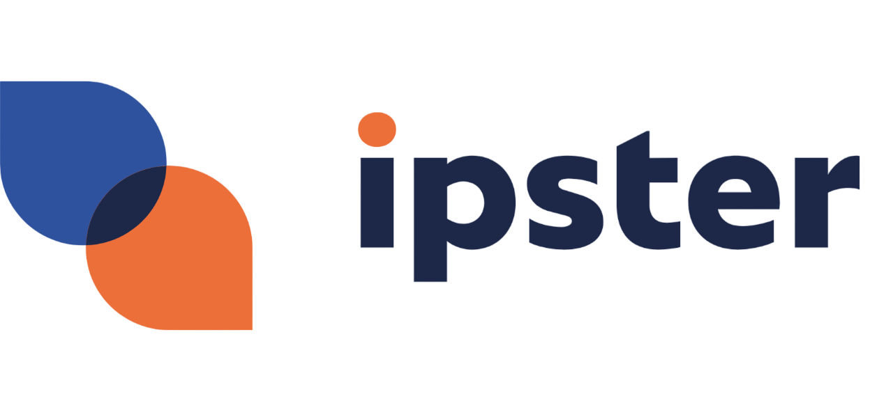

  
  <h1>Ipster Labs</h1>
  
<strong>Building the Ipster AI voice and automation stack: Edge Functions, MCP tools, integrations.</strong>

---

## About Ipster
Ipster builds an AI-driven call center that integrates with your website, CRM, database, and calendar. Routine questions are handled automatically and complex cases are routed to a human. Data is hosted in the Netherlands. See https://ipster.nl/ for more details.

This organization page describes the engineering codebases behind Ipster: services, integrations, and developer workflows.

---

## What lives here
- Edge Functions (Supabase): voice/ops endpoints, webhooks, adapters
- MCP repositories: model and context tools used by agents and internal apps
- Integrations: Shopify/CRM/telephony connectors, utility libraries
- Infra and tooling: CI/CD, observability, shared devcontainers

GitHub is the source of truth for deploys.

---

## Links
- Website: https://ipster.nl/
- Dashboard: https://dashboard.ipster.nl/

---

<table>
<tr>
<td>

## Contact  
support@ipster.nl  
(c) Ipster B.V. — internal engineering organization  

</td>
<td align="right" width="200">
  
</td>
</tr>
</table>
